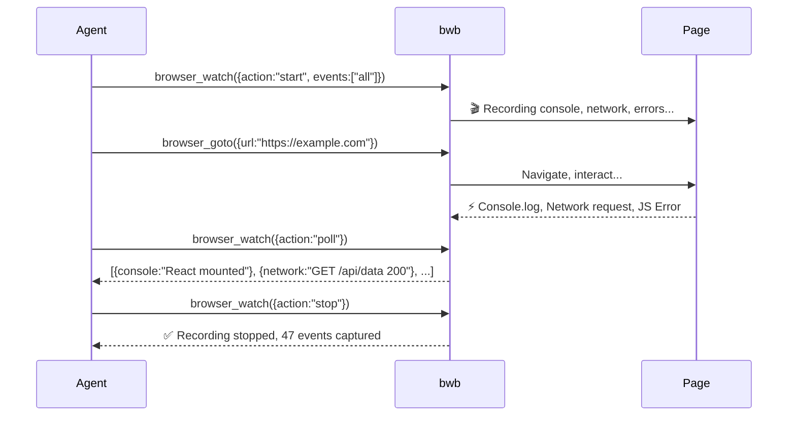

# 🔥 bwb-browser

### Browser Without Bloat — 30KB MCP Browser Automation Server

[](https://www.npmjs.com/package/bwb-browser)
[](https://www.npmjs.com/package/bwb-browser)
[](https://github.com/krshforever/bwb-browser)
[](LICENSE)
[]()

**No Playwright. No Puppeteer. No 400MB downloads. Just raw Chrome DevTools Protocol.**

bwb gives any AI agent (Claude Code, OpenCode, Cline, Antigravity, Cursor, Continue, etc.) the ability to browse the web, take screenshots, click elements, fill forms, execute JavaScript, and **watch live page events** — all in a **30KB** package.

Created by [**Krish Tiwari**](https://github.com/krshforever) ([@krshforever](https://github.com/krshforever)).

---

## 🚀 The Breakthrough: Watch Your Pages Live

**bwb is the first and only MCP browser tool that captures live page events.**



No other MCP browser tool does this. Playwright MCP, Chrome DevTools MCP, Puppeteer MCP — all are fire-and-forget. bwb is the **black box recorder** for browser automation.

Your agent can now:
- **Debug SPAs** — see React/Vue/Angular errors in real-time
- **Track API calls** — every network request, response, and status code
- **Detect loading states** — know when the page is actually done rendering
- **Intercept console output** — catch warnings, logs, and errors as they happen

---

## 📦 Why bwb?

| Feature | bwb | Playwright MCP | Puppeteer MCP | Chrome DevTools MCP |
|---------|-----|----------------|---------------|-------------------|
| **Size** | **30 KB** | 200+ MB | 400+ MB | 300+ MB |
| **Dependencies** | **3 tiny** | 50+ | 30+ | 50+ |
| **Termux/Android** | ✅ **Native** | ❌ | ❌ | ❌ |
| **Works on any platform** | ✅ Linux, macOS, Windows, CI | ⚠️ Needs browsers | ⚠️ Needs Chromium | ⚠️ Needs Puppeteer |
| **Uses your existing Chrome** | ✅ Auto-detects | ❌ Downloads its own | ❌ Downloads its own | ❌ Downloads its own |
| **Live page events** | ✅ **`browser_watch`** | ❌ | ❌ | ❌ |
| **Setup time** | **5 seconds** | 5+ minutes | 5+ minutes | 5+ minutes |

**bwb is 13,000x smaller than Puppeteer MCP.**

---

## ⚡ Quick Install

```bash
npm install -g bwb-browser
```

That's it. **5 seconds.** You're done.

Then add to your AI agent's MCP config:

```json
{
  "mcpServers": {
    "bwb": {
      "command": "bwb"
    }
  }
}
```

> 💡 **For AI Agents:** See [AGENTS.md](AGENTS.md) for the complete copy-paste prompt that auto-installs and configures bwb on Claude Code, OpenCode, Antigravity, Cline, Cursor, Continue.dev, Aider, Codex CLI, Cody, Windsurf, and any MCP-compatible agent.

---

## 🔥 15 Tools

| Tool | Description | Groundbreaking? |
|------|-------------|:---:|
| `browser_goto` | Navigate to a URL | |
| `browser_screenshot` | Take a screenshot (saves to disk + returns base64) | |
| `browser_html` | Get page/selector HTML | |
| `browser_text` | Get page/selector visible text | |
| `browser_click` | Click an element (native CDP mouse events) | |
| `browser_fill` | Fill an input field (native CDP keyboard events) | |
| `browser_elements` | List links, buttons, inputs, headings | |
| `browser_title` | Get page title | |
| `browser_url` | Get current URL | |
| `browser_eval` | Execute JavaScript (with exception capture) | |
| `browser_status` | Browser connection status | |
| **`browser_watch`** | 🔥 **Live console, network, error, navigation capture** | **✅ YES** |
| `browser_waitForSelector` | Wait for element to appear/disappear | |
| `browser_setViewport` | Change viewport size (responsive testing) | |
| `browser_back` | Go back in browser history | |

---

## 🎯 Live Demo (Real Results from Termux/Android)

```
╔══════════════════════════════════════════════════════════╗
║        bwb-browser  —  LIVE DEMO                       ║
║  30KB · 15 tools · raw CDP · zero bloat · on Termux    ║
╚════════════════════════════════════════════════════════╝

  Step 1: Hacker News scraping                     ✅  1.7s
    → #1: 7.1 Earthquake in Japan
    → #2: About the security content of macOS Tahoe 26.6
    → #3: What Even Are Microservices?

  Step 2: GitHub Trending exploration              ✅  5.1s
    → pascalorg/editor, jenkinsci/jenkins, moeru-ai/airi

  Step 3: Google search fill + submit              ✅  4.0s
    → Filled "bwb browser automation termux", submitted

  Step 4: Wikipedia article extraction             ✅  3.2s
    → "A headless browser is a web browser without a GUI..."

  Step 5: Rapid-fire 5 sites in 24s                ✅ 24.1s
    → example.com: 744ms | httpbin.org/ip: 1635ms
    → github.com: 5146ms | wikipedia.org: 15.3s
    → news.ycombinator.com: 1231ms

  Step 6: System status                            ✅  0.1s
    → Connected: true · Chrome PID: 15409

═══════════════════════════════════════════════════════════
  Total: 44.9s · 6 steps · 7 screenshots
═══════════════════════════════════════════════════════════
```

---

## 🛠 Prerequisites

Just **Chrome** or **Chromium** installed anywhere on your system. bwb auto-detects it.

| Platform | Install |
|----------|---------|
| **Termux/Android** | `pkg install chromium` |
| **Linux (Debian/Ubuntu)** | `sudo apt install chromium-browser` |
| **macOS** | `brew install --cask google-chrome` |
| **Windows** | Download from [google.com/chrome](https://www.google.com/chrome/) |
| **CI/Docker** | `apt-get install -y chromium` |

---

## 📋 Configuration

| CLI flag | Env var | Default | Description |
|----------|---------|---------|-------------|
| `--browser-path` | `BWB_CHROME_PATH` | auto-detected | Path to Chrome/Chromium binary |
| `--port` | `BWB_CDP_PORT` | `0` (random free port) | Remote debugging port |
| `--user-data-dir` | `BWB_USER_DATA_DIR` | `~/.cache/bwb-browser` | Browser profile directory |
| `--headless` | `BWB_HEADLESS` | `true` | Run headless (`true`/`false`) |
| `--screenshots-dir` | `BWB_SCREENSHOTS_DIR` | `~/bwb-screenshots/` | Screenshot save location |
| `--timeout` | `BWB_NAV_TIMEOUT` | `30000` | Navigation timeout in ms |

**Note:** On Android/Termux, screenshots default to `/storage/emulated/0/Download/bwb-screenshots/` so they're accessible from any file manager or gallery app.

---

## 🤖 Compatible AI Agents

bwb works with **every major AI coding agent** via MCP:

| Agent | Config File |
|-------|------------|
| **Claude Code** | `~/.claude/settings.json` |
| **OpenCode** | `~/.config/opencode/opencode.json` |
| **Antigravity CLI** | `~/.gemini/antigravity-cli/mcp_config.json` |
| **Cline** (VS Code) | `~/.cline/mcp.json` |
| **Continue.dev** | `~/.continue/config.json` |
| **Cursor** | `.cursor/mcp.json` |
| **Aider** | Custom tool integration |
| **Codex CLI** | `~/.codex/mcp.json` |
| **Cody** (Sourcegraph) | MCP config |
| **Windsurf** | MCP config |

> 🎯 **Give this to any AI agent to auto-install bwb:** See the copy-paste prompt in [AGENTS.md](AGENTS.md)

---

## 🔥 Using `browser_watch` (The Game Changer)

### Start watching:
```
browser_watch({action: "start", events: ["all"]})
```

### Browse around:
```
browser_goto({url: "https://example.com"})
browser_click({selector: "button"})
```

### See everything that happened:
```
browser_watch({action: "poll"})
# → [{console: "App initialized"}, {network: "GET /api/data 200"}, ...]
```

### Stop recording:
```
browser_watch({action: "stop"})
```

The agent gets **structured event data** — not just screenshots. It can SEE what the page is doing internally.

---

## 🌍 Platform Support

| Platform | Status | Notes |
|----------|--------|-------|
| **Termux/Android** | ✅ **Verified** | Native, no containers. Chromium via `pkg`. |
| **Linux** | ✅ | Works with any Chrome/Chromium |
| **macOS** | ✅ | Google Chrome auto-detected |
| **Windows** | ✅ | Chrome auto-detected |
| **CI/CD (GitHub Actions)** | ✅ | Use `chromium-browser` |
| **Docker** | ✅ | Install chromium in container |

---

## 📦 What's in the Box?

```
bwb-browser              (37KB unpacked)
├── server.mjs            MCP server — 15 tools, CDP integration
├── bin/bwb               CLI entry point
├── AGENTS.md             Agent integration guide + copy-paste prompt
├── BENCHMARKS.md         Competitive comparison data
├── LICENSE               MIT
└── README.md             This file
```

**Zero bloat. No AI framework. No bundled browser. Just the bridge between your agent and Chrome.**

---

## 🆚 Comparison: bwb vs The World

| Metric | bwb | Playwright MCP | Puppeteer MCP | Chrome DevTools MCP |
|--------|-----|----------------|---------------|-------------------|
| Unpacked size | **30 KB** | ~200 MB | ~400 MB | ~300 MB |
| npm install size | **~2 MB** | ~500 MB | ~400 MB | ~300 MB |
| Install time | **5 seconds** | 5+ minutes | 5+ minutes | 5+ minutes |
| Dependencies | **3 packages** | 50+ packages | 30+ packages | 50+ packages |
| Live event capture | ✅ **`browser_watch`** | ❌ | ❌ | ❌ |
| Termux/Android | ✅ **Native** | ❌ | ❌ | ❌ |
| Uses existing Chrome | ✅ Auto-detect | ❌ Downloads its own | ❌ Downloads its own | ❌ Downloads its own |
| Dark mode | ✅ MIT | ✅ Apache 2.0 | ✅ Apache 2.0 | ✅ Apache 2.0 |

---

## 🔜 Roadmap

- **v2.0.x** — Current: 15 tools, `browser_watch`, stable
- **v2.1** — Stealth mode (bot detection bypass via CDP script injection)
- **v2.2** — Cookie/session management (`browser_getCookies`, `browser_setCookie`)
- **v3.0** — Parallel tab management, persistent sessions, network interception
- **bwb Cloud** — Managed browser instances, pay-per-use (coming 2027)

---

## 📄 License

MIT © [Krish Tiwari](https://github.com/krshforever) ([@krshforever](https://github.com/krshforever))

---

<p align="center">
  <b>30KB. Raw CDP. Zero Bloat. Any Agent. Any Platform.</b><br>
  <a href="https://github.com/krshforever/bwb-browser">GitHub</a> ·
  <a href="https://www.npmjs.com/package/bwb-browser">npm</a> ·
  <a href="AGENTS.md">Agent Guide</a>
</p>
